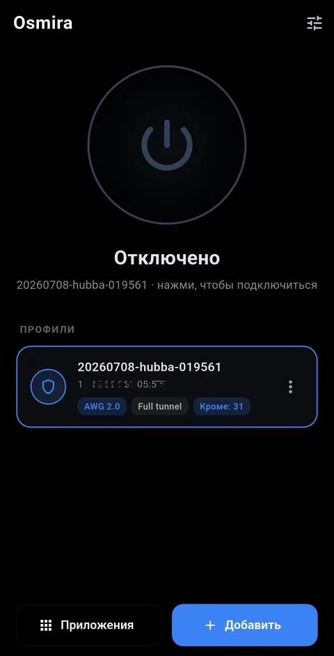
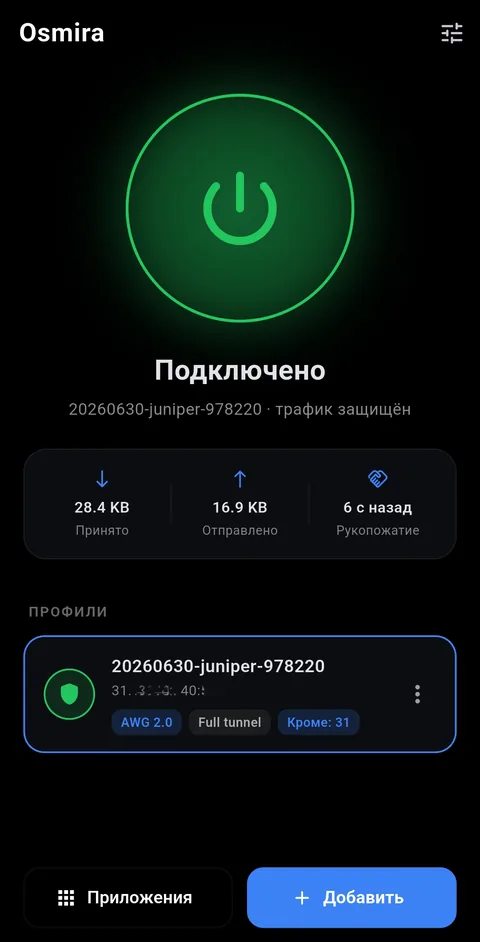

<h1 align="center">Osmira</h1>

<p align="center">
  Простой и честный VPN-клиент <b>AmneziaWG (AWG 2.0)</b> для Android.<br/>
  Закинул <code>.vpn</code>-конфиг, выбрал, какие приложения пускать в туннель, — и забыл.
</p>

<p align="center">
  <b>Русский</b> ·
  <a href="README.en.md">English</a>
</p>

<p align="center">
  
  
  
</p>

<p align="center">
  
  &nbsp;&nbsp;
  
</p>

## Что умеет

Osmira работает по AmneziaWG — это WireGuard с обфускацией, из-за которой
рукопожатие не выделяется в трафике (`Jc/Jmin/Jmax`, `S1–S4`, `H1–H4`,
`I1–I5` — все параметры AWG2 поддержаны). Задача клиента — быть незаметным и
надёжным: импортировал конфиг, нажал «подключить», и он держит соединение.

- **Импорт чего угодно из AmneziaWG** — открой `.vpn`-файл, вставь `vpn://`-ссылку
  или скорми обычный `.conf`.
- **Раздельный туннель, глобально** — весь трафик через VPN, либо список
  приложений *мимо* туннеля (например, банк), либо *только* выбранные приложения.
- **Держит соединение** — сам переподключается при смене сети или зависании
  туннеля, переживает глубокий сон устройства.
- **Тихий и лёгкий** — одно уведомление, чёрный интерфейс во весь экран,
  без аккаунтов, аналитики и рекламы.

## Установка

Osmira распространяется через **GitHub Releases**, поэтому магазины на базе
GitHub подхватывают её сами:

- **[Obtainium](https://github.com/ImranR98/Obtainium)** — *Add App*, вставь
  ссылку на этот репозиторий. Все будущие релизы прилетят как обновления.
- **[Komi Store](https://www.komistore.app) / RepoStore** — найди *Osmira*;
  они показывают репозитории, которые публикуют APK.
- **Вручную** — из [последнего релиза](../../releases/latest) скачай
  `osmira-<версия>-arm64.apk` (почти любой телефон) или `-x86_64.apk`
  (эмуляторы) и открой.

> На Android 13+ при первом запуске приложение попросит разрешение на
> уведомления — оно нужно только для статуса подключения.

## Обновления

Каждый релиз поднимает версию, так что Obtainium/Komi Store видят обновление
сразу после публикации. Сборки всегда подписаны одним ключом — обновление
ставится поверх, без удаления.

## Собрать самому

```bash
cd app
flutter pub get
flutter build apk --release        # подпишется, если есть android/key.properties
```

Нативный бэкенд AmneziaWG (`libwg-go.so`, arm64-v8a + x86_64) лежит в
`app/android/app/src/main/jniLibs/`. Чтобы пересобрать его, нужен патченый
Go-тулчейн и исходники AmneziaWG — смотри `build-libwg-go.sh`.

## Приватность и безопасность

- Никакой телеметрии и аккаунтов, наружу ничего не уходит — только твой туннель.
- Профили содержат приватные ключи WireGuard, поэтому хранятся в зашифрованном
  хранилище Android (на базе Keystore), а не в открытых настройках.
- Релизные сборки проходят **R8 + обфускацию Dart**, бэкапы отключены,
  открытый HTTP запрещён, а манифест просит минимум разрешений.

## Лицензия

MIT — см. [`LICENSE`](LICENSE). Встроенный бэкенд AmneziaWG / WireGuard-Go —
© WireGuard LLC и Amnezia, тоже под MIT. «WireGuard» — зарегистрированный
товарный знак Jason A. Donenfeld. Osmira — независимый клиент и не связан с
Amnezia или WireGuard.
